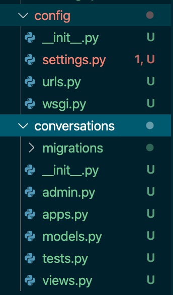

# Django Study notes

## Backend 역할

1. Mega Framework로서 많은 api, tool을 제공함

   - 대신 자유도의 한계가 발생할 수 있음
   - 기존 규칙을 잘 알아야 쓸 수 있음

   Flask, Pyramid와 같은 micro framework 등도 사용할 수 있음

   - 자유도가 높은 대신 개발기간 오래 걸림

## Frontend 역할

1. React

   - 널리 사용됨
   - 사용자와의 상호작용 많을 때 좋음 : 메뉴펼침, 페이지 이도없는 팝업 등..
   - 빠른 상호작용

2. Django
   - Django Template을 이용
   - 콘텐츠 위주로 사용하는 웹페이지 적합

## 개발환경 만들기

1. python 3 설치

2. pipenv

   - pip + virtualenv
   - 손쉽게 가상환경을 만들고 pip 역할도 수행하여 패키지를 관리할 수 있음
     ```bash
     brew install pipenv
     pipenv --three
     ```

3. Django 설치
   virtualenv 안에서...
   ```bash
   pipenv install Django=="version"
   ```

## Django 프로젝트 만들기

1. 프로젝트 생성

   1.1 초보자 용

   ```bash
   django-admin startproject "proj-name"
   ```

   or ...

   1.2 숙련자 용

   ```bash
   django-admin startproject config
   ```

2. config 폴더 이름 변경 -> Aconfig 등 아무거나

   2.1. config 폴더내 config, manage.py 밖으로 꺼내기
   2.2. 기존 Aconfig 폴더 삭제

3. settings.py

   -> Django 프로젝트와 관련된 설정을 입력함 (포함할 앱, 시간대, 언어 등..)

## Django 와 python

- Django 의 model은 python 의 object와 유사한 단위임

- 단, Django에서 model을 만들면 추가적인 정보를 더해서 python의 object로 변환하고

- 이를 QuerySet API(QuerySet Manager)를 통해 object 안의 정보를 접근할 수 있게 한다.

- QuerySet Manager를 통해 object를 코드상에서 create/modify/delete 할 수 있음

  > seed_amenities.py 예제 참고

- 한 모델내에서 만들어진 Object는 Primary Key(pk)를 이용하여 접근할 수 있음

- foreignkey 객체 접근, Manytomany 객체 접근 방법도 아래 예제 참고

> seed_rooms.py 참고

## Migration

1. Django 가 코드내의 데이터 변경을 감지하여 DB로 저장하는 기능

   -> models.py -> Django(migration) -> SQLite3 DB

   -> 이 말의 뜻은 Django가 models의 데이터를 파악해서 DB가 해석할 수 있는 형식으로 변환하여 SQLight3에 저장해줌을 의미함

   ```bash
   python manage.py migrate
   ```

> Structured Query Language
>
> - 관계형 데이터베이스 관리 시스템(RDBMS)의 데이터를 관리하기 위해 설계된 특수 목적의 프로그래밍 언어

## Django Project 구성

1. Project : App 의 집합

   - Project 생성 시 지정한 이름(config)안에 있는 settings.py, urls.py 등을 통해 여러 APP을 통합하고 관리할 수 있음

2. App : fuction 의 집합

   - App 을 만들때는 fuction이 핸들링하는 대상을 기준으로 만들면 좋음

   - 많은 함수를 다루는 거대 App은 좋지 않음

   - 최대한 기능을 작은 단위로 나누어 앱을 만들자 (Divide & Conquer)

   - App은 한 문장으로 해당 기능을 설명할 수 있어야함

     -> 설명하는 문장에 "And"가 들어가면 안됨!!

> [Airbnb 예시]
>
> App name : room
>
> > functions: make, delete, modify, show, search, upload 등..
>
> 모두 room을 대상으로 하는 함수들의 집합

3. App 생성

   ```bash
       django-admin startapp "app_name"
   ```

   - 자동으로 앱 이름으로 폴더와 몇가지 파일이 생성됨

   - 자동 생성된 파일들은 static name을 가지며 이는 Django Framework이 해석하는 파일이므로 변경할 수 없음

   

   - admin.py: admin 패널에서의 해당 앱 내용 수정

   - models.py: 해당 앱에서 사용하는 데이터베이스를 정의하고, 데이터를 변경함, 데이터가 보여지는 모양

   - views.py: Frontend와의 연결 점

   - urls.py: 웹사이트 url 컨드롤, config/urls.py는 앱 전체를 포함하고, 각 앱의 urls.py에서 앱의 상세 페이지를 설정하는 것이 좋음, 앱의 urls.py는 생성해야함
